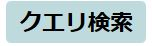

<a href="http://mb.cloud.nifty.com/?utm_source=referral&utm_medium=community&utm_campaign=community"></a>

<a href="../../issues?q=">
  
</a>
<a href="../../issues/new">
  
</a> 
<a href="http://mb.cloud.nifty.com/doc/current/?utm_source=referral&utm_medium=community&utm_campaign=community">
  
</a> 

<a href="../../labels/Android">
  
</a>
<a href="../../labels/iOS">
  
</a> 
<a href="../../labels/JavaScript">
  
</a>
<a href="../../labels/Unity">
  
</a>
<a href="../../labels/Monaca">
  
</a> 
<a href="../../labels/REST API">
  
</a>
<a href="../../labels/SDK">
  
</a> 
<a href="../../labels/コントロールパネル">
  
</a>
<a href="../../labels/相談">
  
</a>
<a href="../../labels/アプリ紹介">
  
</a>
<a href="../../labels/セミナー情報">
  
</a>
<a href="../../labels/TIPS">
  
</a>
<a href="../../labels/会員管理">
  
</a>
<a href="../../labels/SNS連携">
  
</a>
<a href="../../labels/データストア">
  
</a>
<a href="../../labels/プッシュ通知">
  
</a>
<a href="../../labels/クエリ検索">
  
</a>

# ニフティクラウド mobile backend ユーザーコミュニティ

こちらは[ニフティクラウド mobile backend](http://mb.cloud.nifty.com/?utm_source=referral&utm_medium=community&utm_campaign=community)のユーザーコミュニティになります。Issues(投稿)を使って運用されていますので、ニフティクラウド mobile backendを使っていく中での不明点、Tips、利用例などを投稿してください。

## ご注意

こちらは[ニフティクラウド mobile backend](http://mb.cloud.nifty.com/?utm_source=referral&utm_medium=community&utm_campaign=community)の全ユーザ向けのユーザーコミュニティです。エヴァンジェリストとして [moongift](https://github.com/moongift) と、 コミュニティサポートとしてニフティのメンバーが参加することがあります。ただし、回答保証はありません。回答保証があるサポートを希望される場合、[有償プラン](http://mb.cloud.nifty.com/price.htm?utm_source=referral&utm_medium=community&utm_campaign=community)にて提供しておりますテクニカルサポートをご利用ください。

アプリケーションキー、クライアントキーや認証情報などセキュリティに関係する情報や個人情報は書き込まないようお願いします。

他者を誹謗中傷したり、公共良俗に反する内容を投稿しないようお願いします。公共良俗に反する内容が発生する恐れがある際、管理者によってissueをクローズ場合があります。

投稿して頂いた内容では問題解決できたとしても、他の開発者にも参考になる情報なので、クローズしないようお願いします。

コミュニティに参加するニフティのメンバー：
<p>
<a href="https://github.com/ncmbadmin">
  
</a>
<a href="https://github.com/ncmbsupport">
  
</a>
<a href="https://github.com/ncmbinfo">
  
</a>
</p>

## こんな投稿が可能です

- ニフティクラウド mobile backendを使っている中での不明点
  - サーバサイドが絡むとこのコミュニティでは回答できない可能性があります。
  - こんな機能を作りたいですが、ニフティクラウドmobile backendを使ったらできますか？ぜひ気楽に相談してください！
  - サービスの細かい仕様の確認などもどうぞ！
- ニフティクラウド mobile backendを使ってみた
  - アプリ紹介、ブログ記事など何でも結構です。ぜひ自慢してください！
  - こんな使い方だったら便利ですよ！ぜひシェアしましょう！

例えば、

```
ニフティクラウドmobile backendを使ってこんなアプリを作りました！ぜひ使ってみてください！
```

```
プッシュ通知の実装が分からない！助けてください
```

```
ユーザー管理の認証機能ってどんなものですか？助けてください！
```

```
プッシュ通知を登録したのですが、「配信エラー」になっています。なぜですか？
```

```
REST APIを使いたいんですが、Javaからアクセスしたら認証エラーがかえってしまいました、どこが問題でしょうか？
```

# 開発での課題解決や情報共有にぜひご活用ください！

<a href="../../issues?q=">
  
</a>
<a href="../../issues/new">
  
</a>
