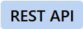
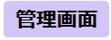
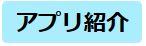
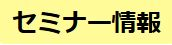

<a href="https://mbaas.nifcloud.com/?utm_source=referral&utm_medium=community&utm_campaign=community"></a>

<a href="../../issues">
  
</a>
<a href="../../issues/new">
  
</a>
<a href="https://github.com/NIFCloud-mbaas/UserCommunity/issues?page=1&q=is%3Aissue+is%3Aopen+%E9%81%8E%E5%8E%BB%E8%B3%AA%E5%95%8F++in%3Atitle&utf8=%E2%9C%93">
  
</a>
<br>
ジャンル別の質問一覧はこちら
<br>
<a href="../../labels/Android">
  
</a>
<a href="../../labels/FCM">
  
</a>
<a href="../../labels/iOS%28Swift%29">
  
</a>
<a href="../../labels/iOS%28Obj-C%29">
  
</a>
<a href="../../labels/JavaScript">
  
</a>
<a href="../../labels/Unity">
  
</a>
<a href="../../labels/Monaca">
  
</a>
<a href="../../labels/Ruby">
  
</a>

<br>

<a href="../../labels/会員管理">
  
</a>
<a href="../../labels/SNS連携">
  
</a>
<a href="../../labels/データストア">
  
</a>
<a href="../../labels/プッシュ通知">
  
</a>
<a href="../../labels/クエリ検索">
  
</a>

<br>
<a href="../../labels/REST API">
  
</a>
<a href="../../labels/SDK">
  
</a>
<a href="../../labels/管理画面">
  
</a>
<a href="../../labels/相談">
  
</a>
<a href="../../labels/アプリ紹介">
  
</a>
<a href="../../labels/セミナー情報">
  
</a>
<a href="../../labels/TIPS">
  
</a>


# ニフクラ mobile backend ユーザーコミュニティ

こちらは[ニフクラ mobile backend](https://mbaas.nifcloud.com/?utm_source=referral&utm_medium=community&utm_campaign=community) のユーザーコミュニティになります。Issues(投稿)を使って運用されていますので、ニフクラ mobile backend を使っていく中での不明点、Tipsなどを投稿してください。

## ご注意

こちらは[ニフクラ mobile backend](https://mbaas.nifcloud.com/?utm_source=referral&utm_medium=community&utm_campaign=community) の全ユーザ向けのユーザーコミュニティです。エヴァンジェリストとして [moongift](https://github.com/moongift) と、 コミュニティサポートとしてニフクラ mobile backend のメンバーが参加することがあります。ただし、回答保証はありません。回答保証があるサポートを希望される場合、[有償プラン](https://mbaas.nifcloud.com/price.htm?utm_source=referral&utm_medium=community&utm_campaign=community)にて提供しておりますテクニカルサポートをご利用ください。

アプリケーションキー、クライアントキーや認証情報などセキュリティに関係する情報や個人情報は書き込まないようお願いします。

他者を誹謗中傷したり、公共良俗に反する内容を投稿しないようお願いします。公共良俗に反する内容が発生する恐れがある際、管理者によってissueをクローズ場合があります。

投稿して頂いた内容では問題解決できたとしても、他の開発者にも参考になる情報なので、クローズしないようお願いします。

コミュニティに参加するサポートメンバー：
<p>
<a href="https://github.com/ncmbadmin">
  
</a>
<a href="https://github.com/ncmbsupport">
  
</a>
<a href="https://github.com/ncmbinfo">
  
</a>
</p>

## こんな投稿が可能です

- ニフクラ mobile backend を使っている中での不明点
  - サーバサイドが絡むとこのコミュニティでは回答できない可能性があります。
  - こんな機能を作りたいですが、ニフクラ mobile backend を使ったらできますか？ぜひ気楽に相談してください！
  - サービスの細かい仕様の確認などもどうぞ！
- ニフクラ mobile backend を使ってみた
  - アプリ紹介、ブログ記事など何でも結構です。ぜひ自慢してください！
  - こんな使い方だったら便利ですよ！ぜひシェアしましょう！

例えば、


```
プッシュ通知エラーになってしまいました！助けてください
```

```
ユーザー管理の認証機能ってなかなかドキュメントの通りに動いていません、どこか間違えてますでしょうか
```

```
REST APIを使いたいんですが、Javaからアクセスしたら認証エラーがかえってしまいました、どこが問題でしょうか？
```

# 開発での課題解決や情報共有にぜひご活用ください！

<a href="../../issues?q=">
  
</a>
<a href="../../issues/new">
  
</a>
